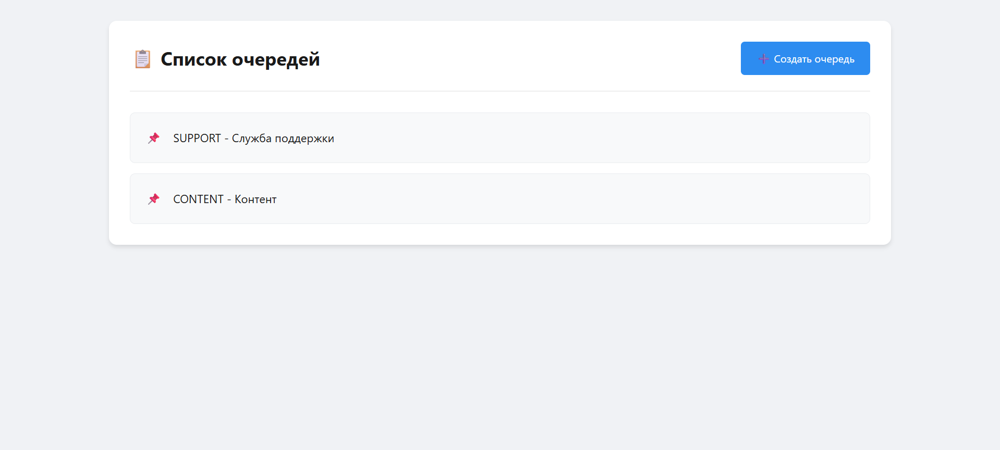
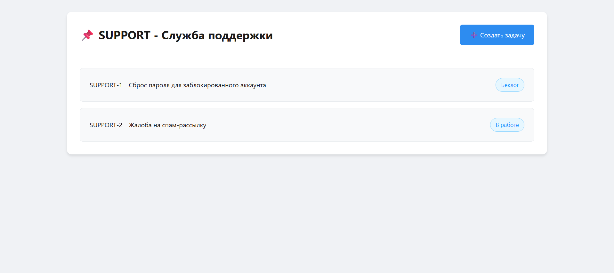
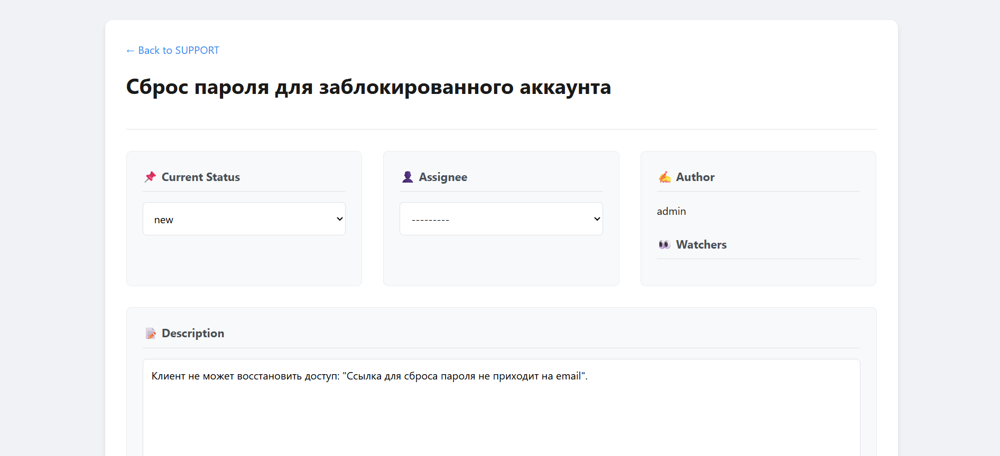
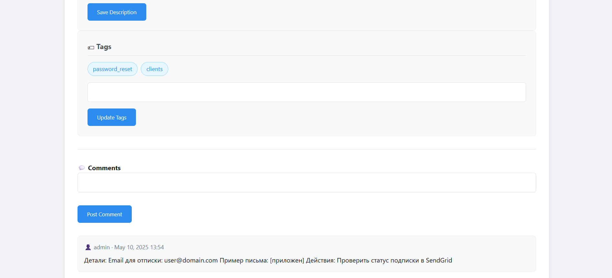

## 1. Цель проекта

Создать минимально жизнеспособный продукт (MVP) бэкенда для таск-трекера с базовым функционалом:
- Управление задачами с уникальной нумерацией в рамках очередей
- Система комментариев к задачам
- Работа с пользователями (авторы, исполнители, наблюдатели)
- Гибкая классификация через теги и статусы

---

## 2. Функциональные требования

### 2.1. Основные сущности
| Сущность       | Описание                                                                 |
|----------------|-------------------------------------------------------------------------|
| **Задача**     | Основная единица системы. Содержит тему, описание, связи с пользователями |
| **Очередь**    | Группа задач с уникальным ключом (например, "PROJ")                      |
| **Тег**        | Метка для категоризации задач ("баг", "фича")                            |
| **Статус**     | Этап жизненного цикла задачи ("В работе", "Готово")                      |
| **Пользователь**| Участник системы с ролью автора/исполнителя/наблюдателя                 |
| **Комментарий**| Текстовое сообщение, привязанное к задаче                               |

### 2.2. Обязательные функции
#### Для задач:
- Создание/редактирование/удаление
- Назначение исполнителя и наблюдателей
- Добавление/удаление тегов
- Изменение статуса
- Автоматическая генерация ключа задачи (КЛЮЧ_ОЧЕРЕДИ-НОМЕР)
- Фильтрация по: очереди, тегам, статусу, исполнителю, автору
- Добавление комментариев

#### Для комментариев:
- Создание/редактирование/удаление (только автор)
- Просмотр в хронологическом порядке

#### Для очередей:
- Создание/редактирование/удаление
- Просмотр списка задач в очереди

#### Для пользователей:
- Регистрация и аутентификация (JWT)
- Просмотр своих задач (автор/исполнитель)

